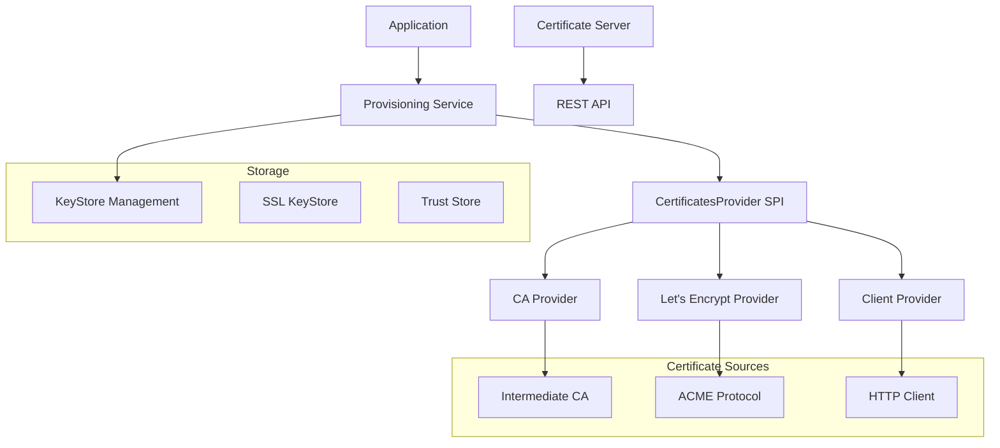

# Xorcery Certificates Extension

## Table of Contents
- [Overview](#overview)
- [Architecture](#architecture)
- [Module Structure](#module-structure)
- [Configuration Reference](#configuration-reference)
- [Usage Guide](#usage-guide)
- [API Reference](#api-reference)
- [Deployment Scenarios](#deployment-scenarios)
- [Examples](#examples)
- [Troubleshooting](#troubleshooting)

## Overview

The `xorcery-certificates` module provides a comprehensive certificate management system for Xorcery applications. It supports multiple certificate sources, automatic provisioning and renewal, and flexible deployment scenarios from development to production.

### Key Features

- **Multiple Certificate Providers**: Support for internal CA, Let's Encrypt, and remote certificate servers
- **Automatic Lifecycle Management**: Certificate provisioning, renewal, and keystore updates
- **RESTful API**: HTTP endpoints for certificate requests and management
- **ACME Protocol Support**: Full Let's Encrypt integration with HTTP-01 challenges
- **Flexible Authorization**: Multiple authorization modes for certificate requests
- **Development Tools**: Pre-configured keystores and CA for testing

### Dependencies

- Java 21+
- BouncyCastle for cryptographic operations
- HK2 for dependency injection
- Jetty for HTTP server functionality
- Jackson for JSON processing

## Architecture



The architecture follows a provider pattern where multiple certificate sources can be plugged in through the `CertificatesProvider` SPI. The provisioning service orchestrates certificate lifecycle management, while the server component provides REST APIs for certificate requests.

## Module Structure

### xorcery-certificates-spi
**Purpose**: Service Provider Interface for certificate providers
**Key Classes**:
- `CertificatesProvider`: Main interface for certificate sources
- Defines contract for certificate request processing

### xorcery-certificates-provisioning
**Purpose**: Core certificate lifecycle management
**Key Classes**:
- `CertificateProvisioningService`: Main service orchestrator
- `RequestCertificateProcess`: Certificate request workflow
- `CertificatesConfiguration`: Configuration management

### xorcery-certificates-ca
**Purpose**: Intermediate Certificate Authority implementation
**Key Classes**:
- `IntermediateCACertificatesProvider`: CA certificate issuing
- `IntermediateCAService`: CA service registration
- `CertificateAuthorityResource`: REST endpoints for CA operations

### xorcery-certificates-server
**Purpose**: Certificate request server
**Key Classes**:
- `ServerCertificatesProvider`: Server-side certificate management
- `CertificateRequestResource`: REST API for certificate requests
- `CertificatesServerConfiguration`: Server configuration

### xorcery-certificates-client
**Purpose**: HTTP client for remote certificate requests
**Key Classes**:
- `ClientCertificatesProvider`: HTTP client implementation
- JSON:API integration for certificate requests

### xorcery-certificates-letsencrypt
**Purpose**: Let's Encrypt ACME integration
**Key Classes**:
- `LetsEncryptCertificatesManagementProvider`: ACME protocol implementation
- `HttpChallengeResource`: HTTP-01 challenge handler

## Configuration Reference

### Core Certificate Configuration

```yaml
certificates:
  enabled: true                    # Enable certificate management
  keystore: "ssl"                 # Target keystore name
  renewOnStartup: false           # Force renewal on startup
  alias: "self"                   # Certificate alias in keystore
  subject: "server.example.com"   # Certificate subject/CN
  ipAddresses: []                 # IP SANs
  dnsNames: []                    # DNS SANs
```

### Certificate Server Configuration

```yaml
certificates:
  server:
    enabled: true
    authorization: "none"          # none|provisioning|dns|ip
```

**Authorization Modes**:
- `none`: Accept all certificate requests
- `provisioning`: Verify CSR signed by provisioning key
- `dns`: Validate DNS ownership (future)
- `ip`: Validate IP address ranges (future)

### Certificate Client Configuration

```yaml
certificates:
  client:
    enabled: true
    uri: "srv://_certificates._sub._https._tcp/api"  # Service discovery URI
```

### Intermediate CA Configuration

```yaml
intermediateca:
  enabled: true
  alias: "intermediate"           # CA certificate alias
  validity: "90d"                # Certificate validity period
```

### Let's Encrypt Configuration

```yaml
letsencrypt:
  enabled: true
  url: "acme://letsencrypt.org"   # ACME server URL
  keystore: "letsencrypt"         # Keystore for ACME keys
```

### KeyStore Configuration

```yaml
keystores:
  enabled: true
  defaultPassword: "secret:password"
  stores:
    - name: "ssl"
      template: "META-INF/ssl.p12"
      path: "{{ instance.home }}/ssl.p12"
      password: "{{ keystores.defaultPassword }}"
    - name: "truststore"  
      template: "META-INF/truststore.p12"
      path: "{{ instance.home }}/truststore.p12"
      password: "{{ keystores.defaultPassword }}"
      addRootCa: true
```

## Usage Guide

### Basic Certificate Provisioning

1. **Add Dependencies**:
```xml
<dependency>
    <groupId>dev.xorcery</groupId>
    <artifactId>xorcery-certificates-provisioning</artifactId>
</dependency>
<dependency>
    <groupId>dev.xorcery</groupId>
    <artifactId>xorcery-certificates-ca</artifactId>
</dependency>
```

2. **Configure Certificate Subject**:
```yaml
certificates:
  enabled: true
  subject: "{{ instance.fqdn }}"
  dnsNames:
    - "*.example.com"
    - "api.example.com"
```

3. **The provisioning service automatically**:
    - Generates a CSR with the configured subject and SANs
    - Requests certificates from available providers
    - Updates the keystore with new certificates
    - Schedules renewal before expiration

### Setting Up Internal CA

For development or internal use:

```yaml
# Enable intermediate CA
intermediateca:
  enabled: true
  validity: "90d"

# Configure keystores with CA templates
keystores:
  stores:
    - name: "castore"
      template: "META-INF/intermediatecakeystore.p12"
      path: "{{ instance.home }}/intermediatecakeystore.p12"
      password: "{{ keystores.defaultPassword }}"
```

The CA automatically:
- Issues certificates signed by the intermediate CA
- Includes proper certificate extensions
- Maintains certificate chains
- Provides CRL endpoints

### Setting Up Let's Encrypt

For production internet-facing certificates:

```yaml
letsencrypt:
  enabled: true
  url: "acme://letsencrypt.org"

# Register HTTP challenge resource
jersey:
  server:
    register:
      - dev.xorcery.certificates.letsencrypt.resources.HttpChallengeResource

# Configure domain validation
certificates:
  subject: "api.example.com"
  dnsNames:
    - "www.example.com"
```

**Important**: Ensure your server is publicly accessible on port 80 for HTTP-01 challenges.

### Certificate Server Setup

To provide certificates to other services:

```yaml
certificates:
  server:
    enabled: true
    authorization: "provisioning"  # Require signed CSRs

# Register certificate request endpoint  
jersey:
  server:
    register:
      - dev.xorcery.certificates.server.resources.CertificateRequestResource
```

### Certificate Client Setup

To request certificates from a remote server:

```yaml
certificates:
  client:
    enabled: true
    uri: "https://ca.example.com/api"

# Disable other providers to only use client
intermediateca:
  enabled: false
letsencrypt:
  enabled: false
```

## API Reference

### REST Endpoints

#### GET /api/certificates/request
Returns a template for certificate requests.

**Response**:
```json
{
  "data": {
    "type": "certificaterequest",
    "attributes": {
      "csr": ""
    }
  }
}
```

#### POST /api/certificates/request
Submit a certificate signing request.

**Request**:
```json
{
  "data": {
    "type": "certificaterequest", 
    "attributes": {
      "csr": "-----BEGIN CERTIFICATE REQUEST-----\n..."
    }
  }
}
```

**Response**:
```json
{
  "data": {
    "type": "certificate",
    "attributes": {
      "pem": "-----BEGIN CERTIFICATE-----\n..."
    }
  }
}
```

#### GET /api/ca/rootca.cer
Download root CA certificate (DER format).

#### GET /api/ca/intermediateca.crl
Download Certificate Revocation List (PEM format).

#### GET /.well-known/acme-challenge/{token}
ACME HTTP-01 challenge response.

### Java API

#### CertificatesProvider Interface

```java
public interface CertificatesProvider {
    CompletionStage<List<X509Certificate>> requestCertificates(PKCS10CertificationRequest csr);
}
```

#### Certificate Provisioning Service

```java
@Inject
CertificateProvisioningService provisioningService;

// Create CSR
PKCS10CertificationRequest csr = provisioningService.createRequest();

// Manual certificate request (normally automatic)
CompletionStage<List<X509Certificate>> certificates = 
    provisioningService.requestCertificates(csr);
```

## Deployment Scenarios

### Development Environment

Use the provided test keystores and CA:

```yaml
# Use test keystores with pre-generated certificates
keystores:
  stores:
    - name: "ssl"
      template: "META-INF/ssl.p12" 
      password: "password"

# Enable internal CA for development
intermediateca:
  enabled: true
  
certificates:
  enabled: false  # Disable automatic provisioning
```

### Staging Environment

Use Let's Encrypt staging for testing:

```yaml
letsencrypt:
  enabled: true
  url: "acme://letsencrypt.org/staging"

certificates:
  enabled: true
  subject: "staging.example.com"
  renewOnStartup: true  # Always get fresh certificates
```

### Production Environment

```yaml
# Production Let's Encrypt
letsencrypt:
  enabled: true
  url: "acme://letsencrypt.org"

# Production domain
certificates:
  enabled: true
  subject: "api.example.com"
  dnsNames:
    - "www.example.com"
    - "api.example.com"

# Secure keystore location
keystores:
  stores:
    - name: "ssl"
      path: "/etc/ssl/private/ssl.p12"
      password: "secret:SSL_KEYSTORE_PASSWORD"
```

### Distributed Architecture

**Certificate Authority Server**:
```yaml
certificates:
  server:
    enabled: true
    authorization: "provisioning"
intermediateca:
  enabled: true
```

**Client Services**:
```yaml
certificates:
  client:
    enabled: true
    uri: "srv://_certificates._sub._https._tcp/api"
  
# Disable other providers
intermediateca:
  enabled: false
letsencrypt:
  enabled: false
```

## Examples

### Complete Development Setup

```yaml
$schema: xorcery-schema.json

# Instance configuration
instance:
  domain: "example.local"
  fqdn: "api.example.local"

# Enable certificate management
certificates:
  enabled: true
  subject: "{{ instance.fqdn }}"
  renewOnStartup: false
  
# Enable internal CA
intermediateca:
  enabled: true
  validity: "90d"

# Configure keystores
keystores:
  enabled: true
  defaultPassword: "secret:password"
  stores:
    - name: "ssl"
      template: "META-INF/ssl.p12"
      path: "{{ instance.home }}/ssl.p12" 
      password: "{{ keystores.defaultPassword }}"
    - name: "truststore"
      template: "META-INF/truststore.p12"
      path: "{{ instance.home }}/truststore.p12"
      password: "{{ keystores.defaultPassword }}"
      addRootCa: true
    - name: "castore"  
      template: "META-INF/intermediatecakeystore.p12"
      path: "{{ instance.home }}/intermediatecakeystore.p12"
      password: "{{ keystores.defaultPassword }}"

# Configure SSL
jetty:
  server:
    ssl:
      enabled: true
      keystore: "ssl"
      truststore: "truststore"
```

### Production Let's Encrypt Setup

```yaml
$schema: xorcery-schema.json

# Production instance
instance:
  domain: "example.com"
  fqdn: "api.example.com"

# Certificate configuration
certificates:
  enabled: true
  subject: "api.example.com"
  dnsNames:
    - "www.example.com"
    - "api.example.com"

# Let's Encrypt configuration  
letsencrypt:
  enabled: true
  url: "acme://letsencrypt.org"

# HTTP challenge support
jetty:
  server:
    http:
      enabled: true
      port: 80
    ssl:
      enabled: true  
      port: 443

jersey:
  server:
    register:
      - dev.xorcery.certificates.letsencrypt.resources.HttpChallengeResource

# Secrets management
secrets:
  env:
    enabled: true

keystores:
  defaultPassword: "secret:KEYSTORE_PASSWORD"
```

## Troubleshooting

### Common Issues

**Certificate Request Fails**:
- Check certificate provider is enabled and configured
- Verify subject and SAN configuration
- Check network connectivity for Let's Encrypt
- Review authorization settings for certificate server

**Let's Encrypt HTTP-01 Challenge Fails**:
- Ensure port 80 is accessible from internet
- Check domain DNS resolution
- Verify HTTP challenge resource is registered
- Check firewall and load balancer configuration

**Keystore Access Issues**:
- Verify keystore path and permissions
- Check password configuration and secrets
- Ensure keystore template exists for new installations

**Certificate Renewal Issues**:
- Check certificate expiration dates
- Review renewal scheduling logic
- Verify provider availability during renewal
- Check keystore write permissions

### Debug Configuration

Enable detailed logging:

```yaml
log4j2:
  Configuration:
    Loggers:
      logger:
        - name: dev.xorcery.certificates
          level: debug
        - name: org.shredzone.acme4j
          level: debug  
        - name: org.bouncycastle
          level: info
```

### Monitoring

Key metrics to monitor:
- Certificate expiration dates
- Renewal success/failure rates
- ACME challenge response times
- Keystore update frequencies
- Certificate chain validation

### Recovery Procedures

**Lost Keystore**:
1. Restore from backup or recreate from template
2. Set `renewOnStartup: true` to force certificate renewal
3. Restart application to trigger provisioning

**Expired Certificates**:
1. Check provider availability
2. Verify domain ownership for Let's Encrypt
3. Force renewal with `renewOnStartup: true`
4. Monitor logs for renewal process
